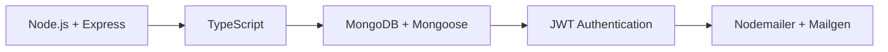

<div align="center">

<picture>
  <source media="(prefers-color-scheme: dark)" srcset="./public/project-camp-light.svg">
  <source media="(prefers-color-scheme: light)" srcset="./public/project-camp-dark.svg">
  
</picture>

<br />
<br />

**A collaborative project management backend built for modern teams**

[](https://www.typescriptlang.org/)
[](https://nodejs.org/)
[](https://expressjs.com/)
[](https://www.mongodb.com/)
[](https://opensource.org/licenses/MIT)
[](http://makeapullrequest.com)

[Features](#-features) • [Quick Start](#-quick-start) • [API Documentation](#-api-documentation) • [Contributing](#-contributing)

</div>

---

## 🚀 Overview

Project Camp is a production-ready backend API for collaborative project management, inspired by Basecamp. Built with TypeScript, it provides a robust foundation for team collaboration with enterprise-grade authentication, role-based access control, and a comprehensive task management system.

## ✨ Features

<table>
<tr>
<td width="50%">

### 🔐 Authentication & Security
- JWT-based authentication (Access + Refresh tokens)
- Secure password hashing with bcrypt
- Email verification flow
- Password reset functionality
- SHA-256 hashed temporary tokens
- Role-based access control (RBAC)

</td>
<td width="50%">

### 📊 Project Management
- Full CRUD operations for projects
- Team member management
- Granular role assignments
- Project notes and documentation
- Task and subtask organization
- File attachment support

</td>
</tr>
</table>

### 🎯 Task Management

- Comprehensive task CRUD operations
- Nested subtask support
- Workflow states: `Todo` → `In Progress` → `Done`
- Task assignment to team members
- File attachments per task

### 📧 Email System

- Beautiful HTML email templates with Mailgen
- SMTP delivery via Nodemailer
- Automated verification and reset emails
- Customizable branding

## 🛠️ Tech Stack



**Core Technologies:**
- **Runtime:** Node.js 18+
- **Framework:** Express.js 4.x
- **Language:** TypeScript 5.0
- **Database:** MongoDB with Mongoose ODM
- **Authentication:** JWT (JSON Web Tokens)
- **Email:** Nodemailer + Mailgen
- **Validation:** Zod schemas

## 📦 Quick Start

### Prerequisites

- Node.js 18+ or Bun
- MongoDB instance
- SMTP credentials (Mailtrap, SendGrid, etc.)

### Installation

```bash
# Clone the repository
git clone https://github.com/YOUR_USERNAME/project-camp.git
cd project-camp

# Install dependencies
bun install
# or
npm install

# Configure environment variables
cp .env.example .env
# Edit .env with your configuration

# Start development server
bun run dev
# or
npm run dev
```

The server will start at `http://localhost:3000`

### Environment Configuration

Create a `.env` file in the root directory:

```env
# Database
MONGODB_URI=your_mongodb_connection_string_here

# Server
PORT=3000

# JWT Tokens
ACCESS_TOKEN_SECRET=your_super_secret_access_token_here_min_32_chars
ACCESS_TOKEN_EXPIRY=1d
REFRESH_TOKEN_SECRET=your_super_secret_refresh_token_here_min_32_chars
REFRESH_TOKEN_EXPIRY=7d

# Email Service (Mailtrap example)
MAILTRAP_SMTP_HOST=sandbox.smtp.mailtrap.io
MAILTRAP_SMTP_PORT=2525
MAILTRAP_SMTP_USER=your_mailtrap_username
MAILTRAP_SMTP_PASS=your_mailtrap_password

# Frontend
FRONTEND_URL=https://your-frontend-url.com
```

> **⚠️ Security Note:** Never commit your `.env` file. Always use strong, randomly generated secrets for production.

## 📁 Project Structure

```
project-camp/
├── src/
│   ├── controllers/         # Route controllers
│   │   ├── auth.controller.ts
│   │   └── healthCheck.controller.ts
│   ├── models/             # Mongoose models
│   │   └── user.models.ts
│   ├── middlewares/        # Express middlewares
│   ├── routers/            # API routes
│   │   └── healthcheck.route.ts
│   ├── validators/         # Zod schemas
│   ├── utils/              # Helper utilities
│   │   ├── api-error.ts
│   │   ├── api-response.ts
│   │   ├── async-handler.ts
│   │   ├── constants.ts
│   │   └── mail.ts
│   ├── db/                 # Database connection
│   │   └── db.ts
│   ├── app.ts              # Express app setup
│   └── index.ts            # Entry point
├── public/                 # Static assets
├── package.json
├── tsconfig.json
└── README.md
```

## 🔗 API Documentation

### Authentication Endpoints

| Method | Endpoint | Description | Auth Required |
|--------|----------|-------------|---------------|
| `POST` | `/api/v1/auth/register` | Register a new user | ❌ |
| `GET` | `/api/v1/auth/verify-email/:token` | Verify email address | ❌ |
| `POST` | `/api/v1/auth/login` | User login | ❌ |
| `POST` | `/api/v1/auth/logout` | User logout | ✅ |
| `POST` | `/api/v1/auth/refresh-token` | Refresh access token | ✅ |
| `POST` | `/api/v1/auth/forgot-password` | Request password reset | ❌ |
| `POST` | `/api/v1/auth/reset-password/:token` | Reset password | ❌ |

### Project Endpoints

| Method | Endpoint | Description | Auth Required |
|--------|----------|-------------|---------------|
| `GET` | `/api/v1/projects` | List user's projects | ✅ |
| `POST` | `/api/v1/projects` | Create new project | ✅ |
| `GET` | `/api/v1/projects/:projectId` | Get project details | ✅ |
| `PUT` | `/api/v1/projects/:projectId` | Update project | ✅ |
| `DELETE` | `/api/v1/projects/:projectId` | Delete project | ✅ |

### Task Endpoints

| Method | Endpoint | Description | Auth Required |
|--------|----------|-------------|---------------|
| `GET` | `/api/v1/tasks` | List tasks | ✅ |
| `POST` | `/api/v1/tasks` | Create task | ✅ |
| `GET` | `/api/v1/tasks/:taskId` | Get task details | ✅ |
| `PUT` | `/api/v1/tasks/:taskId` | Update task | ✅ |
| `DELETE` | `/api/v1/tasks/:taskId` | Delete task | ✅ |

> 📘 **Full API documentation** coming soon with Swagger/OpenAPI specs

## 🎨 Example Usage

### Register a New User

```javascript
POST /api/v1/auth/register
Content-Type: application/json

{
  "email": "user@example.com",
  "password": "SecurePass123!",
  "fullName": "John Doe"
}
```

### Create a Project

```javascript
POST /api/v1/projects
Authorization: Bearer <access_token>
Content-Type: application/json

{
  "name": "Website Redesign",
  "description": "Complete overhaul of company website",
  "deadline": "2024-12-31"
}
```

## 🧪 Available Scripts

```bash
# Development
bun run dev          # Start dev server with hot reload
npm run dev

# Production
bun run build        # Compile TypeScript to JavaScript
bun start            # Start production server
npm run build
npm start

# Code Quality
bun run lint         # Run ESLint
bun run format       # Format code with Prettier
bun test             # Run test suite
```

## 🚀 Deployment

### Deploy to Your Platform

<details>
<summary><b>Vercel</b></summary>

```bash
# Install Vercel CLI
npm i -g vercel

# Deploy
vercel --prod
```

Add environment variables in Vercel dashboard.
</details>

<details>
<summary><b>Railway</b></summary>

```bash
# Install Railway CLI
npm i -g @railway/cli

# Login and deploy
railway login
railway init
railway up
```
</details>

<details>
<summary><b>Render</b></summary>

1. Connect your GitHub repository
2. Set build command: `npm install && npm run build`
3. Set start command: `npm start`
4. Add environment variables
</details>

> **📝 Note:** Remember to set all environment variables on your deployment platform.

## 🤝 Contributing

We love contributions! Here's how you can help:

1. **Fork** the repository
2. **Create** your feature branch (`git checkout -b feature/AmazingFeature`)
3. **Commit** your changes (`git commit -m 'Add some AmazingFeature'`)
4. **Push** to the branch (`git push origin feature/AmazingFeature`)
5. **Open** a Pull Request

Please read our [Contributing Guidelines](CONTRIBUTING.md) for details on our code of conduct and development process.

## 📝 Roadmap

- [ ] Real-time notifications with WebSockets
- [ ] File storage integration (AWS S3, Cloudinary)
- [ ] Advanced search and filtering
- [ ] Activity timeline and audit logs
- [ ] API rate limiting
- [ ] Comprehensive test coverage
- [ ] Docker containerization
- [ ] CI/CD pipeline setup

## 📄 License

This project is licensed under the MIT License - see the [LICENSE](LICENSE) file for details.

## 🙏 Acknowledgments

- Inspired by [Basecamp](https://basecamp.com/)
- Built with [Node.js](https://nodejs.org/)
- Email templates powered by [Mailgen](https://github.com/eladnava/mailgen)

## 📞 Contact & Support

- **GitHub Issues:** [Report a bug or request a feature](https://github.com/shandilyaaryan/project-camp/issues)
- **Email:** aryanshandilya10@gmail.com
- **Twitter:** [@Aryanshandilya9](https://twitter.com/aryanshandilya9)

---

<div align="center">

**[⬆ Back to Top](#project-camp)**

Made with ❤️ by [Aryan Shandilya](https://github.com/shandilyaaryan)

</div>
